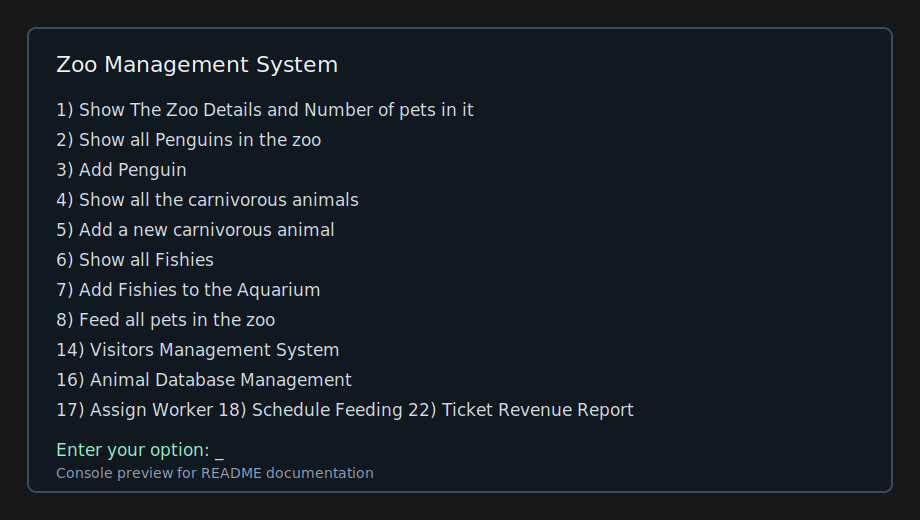
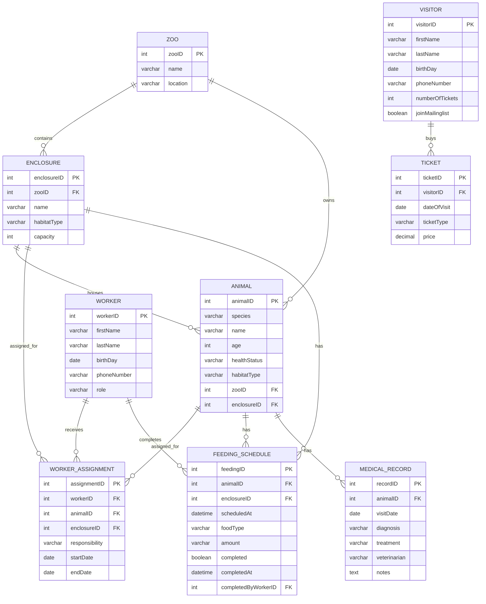

# Zoo Management System


A Java and MySQL application for managing zoo operations.



## Features

- Animal CRUD operations
- Enclosure capacity validation
- Worker assignments
- Feeding schedule and completion tracking
- Medical records
- Ticket sales and revenue reporting
- JUnit service tests
- ER diagram and console screenshot

## Project Evolution

Originally developed as an object-oriented programming course project and later modernized with MySQL persistence, layered architecture, service-level business rules, Maven, and automated tests.

## Architecture

The project uses the standard Maven folder layout:

```text
src/main/java/ZooManagementSystem/    Application source packages
src/main/resources/                   SQL schema and sample data
src/test/java/ZooManagementSystem/    JUnit tests
```

The source packages are organized by responsibility:

```text
ZooManagementSystem.app          Console entry point
ZooManagementSystem.zoo          Main zoo coordinator
ZooManagementSystem.animals      Animal domain classes
ZooManagementSystem.people       Visitor, worker, and human classes
ZooManagementSystem.tickets      Ticket and visitor management flows
ZooManagementSystem.promotions   Observer-based promotion notifications
ZooManagementSystem.data         JDBC repositories and database connection
ZooManagementSystem.models       Database row models used by services
ZooManagementSystem.services     Business rules and use cases
ZooManagementSystem.common       Shared enums
ZooManagementSystem.exceptions   Validation exceptions
```

## Database Setup

Create and seed the MySQL database:

```bash
mysql -u root -p < src/main/resources/DataBase.sql
mysql -u root -p zoo_database < src/main/resources/sample.sql
```

Configure credentials outside the code:

```bash
export ZOO_DB_URL="jdbc:mysql://localhost:3306/zoo_database"
export ZOO_DB_USER="root"
export ZOO_DB_PASSWORD="your-db-password"
export ZOO_ADMIN_USERNAME="Admin"
export ZOO_ADMIN_PASSWORD="your-admin-password"
```

The same values can also be provided with Java system properties: `zoo.db.url`, `zoo.db.user`, `zoo.db.password`, `zoo.admin.username`, and `zoo.admin.password`.

## ER Diagram



## Running

Compile with Maven:

```bash
mvn compile
```

Run the console application:

```bash
mvn exec:java
```

## Tests

Run the JUnit tests:

```bash
mvn test
```

The current tests cover enclosure capacity validation, habitat mismatch validation, safe animal updates inside full enclosures, and ticket revenue report date validation.

## Console Database Features

The console menu includes database-backed options for:

```text
16) Animal Database Management
17) Assign Worker
18) Schedule Feeding
19) Complete Feeding
20) Add Medical Record
21) Show Medical History
22) Ticket Revenue Report
```

These options use the `services` package, which keeps business rules separate from menu input and JDBC code.
